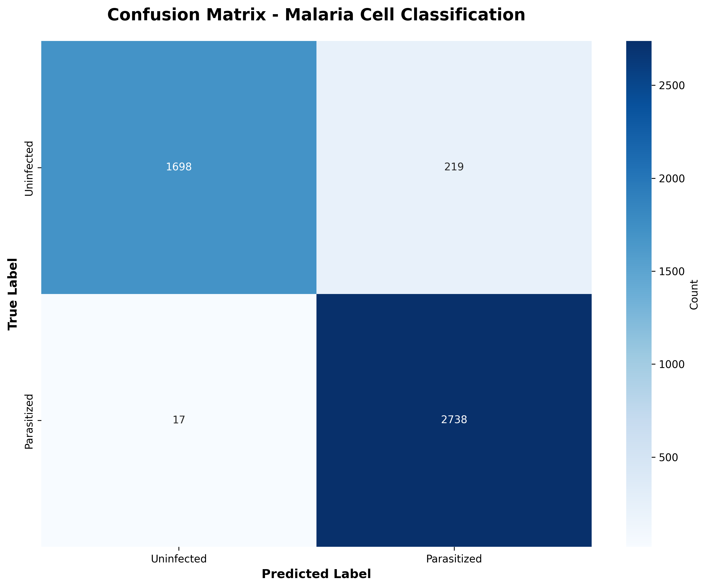
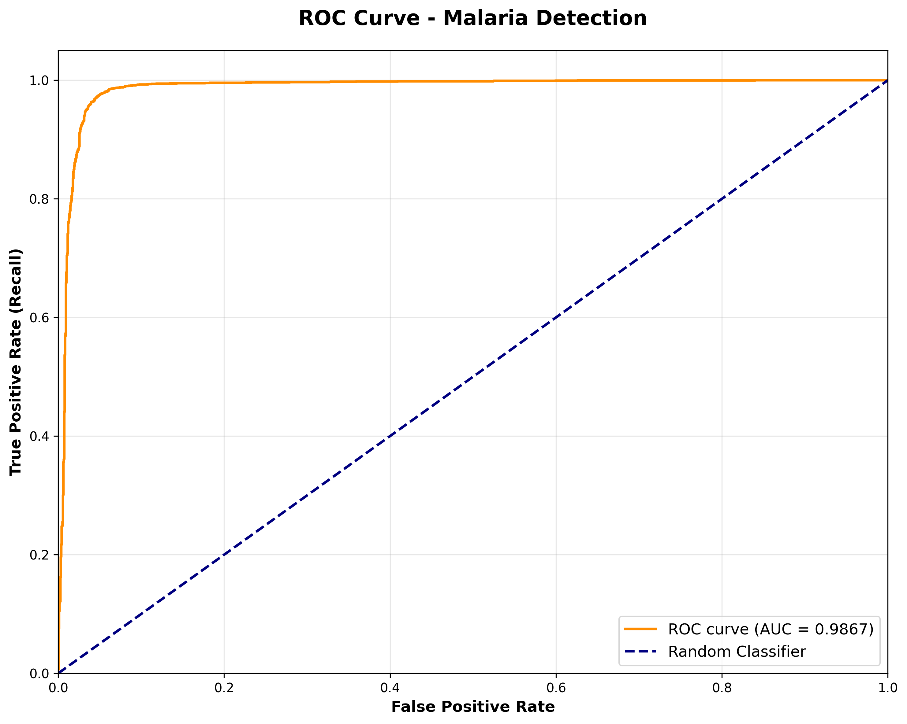

# Malaria-Cell-Image-Classification-using-CNN-with-Apache-Spark
This project focuses on classifying malaria-infected and uninfected blood cell images using a CNN implemented with TensorFlow/Keras, combined with Apache Spark. The objective is to demonstrate the potential for automated malaria screening, particularly in resource-limited regions where microscopy experts are not always readily available.

## 🎯 Project Overview

This project implements an end-to-end solution for automated malaria screening from microscopic blood cell images. Malaria claims approximately 400,000 lives annually, with diagnosis heavily dependent on manual microscopy requiring specialized expertise. This automated system democratizes access to accurate diagnosis in resource-limited regions.

### Key Achievements
- **94.95%** overall accuracy on 4,672 validation images
- **99.38%** sensitivity (only 17 missed infections out of 2,755)
- **ROC AUC: 0.9867** demonstrating excellent discrimination
- Training time optimized to **20 minutes** (reduced from 45+ hours)
- Production-ready architecture with **684,225 trainable parameters**

## 📊 Dataset

- **Source**: [Kaggle - Cell Images for Detecting Malaria](https://www.kaggle.com/datasets/iarunava/cell-images-for-detecting-malaria)
- **Origin**: National Institutes of Health (NIH) repository
- **Total Images**: 23,367 microscopy images
  - Parasitized: 9,589
  - Uninfected: 13,780
- **Format**: PNG color images (variable dimensions, standardized to 64×64×3)
- **Split**: 80/20 train-validation (18,695 / 4,672)

## 🏗️ Architecture

### CNN Model Structure
```
Input (64×64×3 RGB)
    ↓
[Convolutional Block 1] - 32 filters
    → Conv2D (3×3) → BatchNorm → MaxPool → Dropout(0.25)
    ↓
[Convolutional Block 2] - 64 filters
    → Conv2D (3×3) → BatchNorm → MaxPool → Dropout(0.25)
    ↓
[Convolutional Block 3] - 128 filters
    → Conv2D (3×3) → BatchNorm → MaxPool → Dropout(0.25)
    ↓
Flatten (4,608 elements)
    ↓
Dense (128 units, ReLU) → Dropout(0.5)
    ↓
Output (1 unit, Sigmoid) → Probability [0,1]
```

**Total Parameters**: 684,225 (~2.61 MB)

### Data Processing Pipeline

- **Apache Spark**: Distributed data loading and preprocessing
- **Data Augmentation** (training only):
  - Rotation: ±20°
  - Zoom: 15%
  - Horizontal flip
  - Width/Height shift: 20%
  - Shear: 20%
- **Validation**: Only pixel rescaling (unbiased evaluation)

## 📈 Results

### Performance Metrics

| Metric | Value | Clinical Significance |
|--------|-------|----------------------|
| **Accuracy** | 94.95% | Overall correct classifications |
| **Sensitivity (Recall)** | 99.38% | Only 17 missed infections out of 2,755 |
| **Specificity** | 88.57% | True negative rate for healthy cells |
| **Precision** | 92.63% | Positive predictive value |
| **F1-Score** | 95.89% | Harmonic mean of precision/recall |
| **ROC AUC** | 0.9867 | Near-perfect discrimination ability |

### Confusion Matrix



|  | Predicted Negative | Predicted Positive |
|---|--------------------|--------------------|
| **Actual Negative** | 1,698 | 219 |
| **Actual Positive** | 17 | 2,738 |

**Critical Finding**: The 99.38% sensitivity means only 0.62% false negative rate - crucial for medical screening where missed infections can be fatal.

### Dependencies
```bash
pip install tensorflow>=2.0
pip install pyspark>=3.0
pip install numpy pandas scikit-learn
pip install matplotlib seaborn
pip install Pillow
```

# Install dependencies
pip install -r requirements.txt

## 🛠️ Technologies Used

| Technology | Purpose |
|-----------|---------|
| **TensorFlow/Keras** | Deep learning framework for CNN implementation |
| **Apache Spark (PySpark)** | Distributed data loading and preprocessing |
| **NumPy** | Numerical computation and array operations |
| **Pandas** | Data manipulation and metrics organization |
| **Scikit-learn** | Performance metrics (confusion matrix, ROC, etc.) |
| **Matplotlib/Seaborn** | Visualization (training curves, confusion matrix, ROC) |
| **Pillow (PIL)** | Image loading and preprocessing |

## ⚙️ Hyperparameter Optimization

Systematic tuning achieved optimal balance between accuracy and training efficiency:

| Parameter | Value | Rationale |
|-----------|-------|-----------|
| **Learning Rate** | 0.001 | Optimal convergence speed without oscillation |
| **Batch Size** | 128 | Reduced training steps from 585 to 147 per epoch |
| **Epochs** | 10 | Early stopping (convergence by epoch 3-4) |
| **Image Size** | 64×64 | 4× computation reduction, <2% accuracy loss |
| **Dropout** | 0.5 (dense), 0.25 (conv) | Critical regularization balance |
| **Conv Filters** | [32, 64, 128] | Progressive feature extraction at multiple scales |

**Impact**: Training time reduced from 45+ hours to 20 minutes while maintaining 94.95% accuracy.

## 📁 Project Structure
```
malaria-cnn-classification/
│
├── data/
│   └── cell_images/
│       ├── Parasitized/
│       └── Uninfected/
│
├── models/
│   └── malaria_cnn_model.h5
│
├── src/
│   ├── data_loader.py          # Spark-based data loading
│   ├── model.py                 # CNN architecture
│   ├── train.py                 # Training pipeline
│   ├── evaluate.py              # Evaluation metrics
│   └── visualize.py             # Results visualization
│
├── notebooks/
│   └── exploration.ipynb        # Data exploration
│
├── results/
│   ├── confusion_matrix.png
│   ├── roc_curve.png
│   └── training_history.png
│
├── requirements.txt
├── README.md
└── LICENSE
```

## 🔬 Key Features

### 1. **Distributed Data Processing**
- Apache Spark integration for scalable data handling
- Easily extendable to multi-node clusters
- Efficient image loading and preprocessing

### 2. **Optimized CNN Architecture**
- Progressive convolutional blocks (32→64→128 filters)
- Batch normalization for training stability
- Strategic dropout for regularization
- Only 684K parameters for efficient deployment

### 3. **Clinical-Grade Performance**
- 99.38% sensitivity minimizes life-threatening false negatives
- ROC AUC of 0.9867 indicates excellent discrimination
- Balanced precision-recall trade-off

### 4. **Production Ready**
- Fast inference time
- Small model size (~2.61 MB)
- Reproducible training pipeline
- Comprehensive evaluation metrics

## 📊 Visualizations

The project generates three key visualizations:

### 1. Training History
Shows model accuracy and loss curves demonstrating convergence by epoch 3-4 with minimal overfitting.


### 2. Confusion Matrix
Detailed breakdown of classification results highlighting the critical 17 false negatives out of 2,755 parasitized cases.


### 3. ROC Curve
Demonstrates excellent discrimination ability across all classification thresholds with AUC of 0.9867.



## 🎯 Use Cases

- **Resource-Limited Clinics**: Automated screening where expert microscopists are scarce
- **High-Throughput Screening**: 24/7 availability for large-scale testing
- **Quality Assurance**: Secondary validation of manual diagnoses
- **Research**: Baseline for advanced malaria detection research
- **Educational**: Teaching tool for medical imaging and deep learning

## 🔮 Future Enhancements

- [ ] **Explainability**: Implement Grad-CAM for visual interpretation
- [ ] **Multi-Class Classification**: Identify specific Plasmodium species
- [ ] **Cross-Dataset Validation**: Test on diverse geographic samples
- [ ] **Edge Deployment**: Optimize for mobile/IoT devices
- [ ] **Real-Time Inference**: Web API for live microscopy integration
- [ ] **Ensemble Models**: Combine multiple architectures for improved accuracy
- [ ] **Transfer Learning**: Fine-tune on pre-trained medical imaging models

## 📝 Citation

If you use this project in your research, please cite:
```bibtex
@misc{malaria_cnn_2024,
  title={Malaria Cell Image Classification using CNN with Apache Spark},
  author={Dennis Owusu},
  year={2025},
  publisher={GitHub},
  url={https://github.com/RoyalDennis/malaria-cnn-classification}
}
```

## 📄 License

This project is licensed under the MIT License - see the [LICENSE](LICENSE) file for details.

## 🤝 Contributing

Contributions are welcome! Please feel free to submit a Pull Request.

1. Fork the repository
2. Create your feature branch (`git checkout -b feature/AmazingFeature`)
3. Commit your changes (`git commit -m 'Add some AmazingFeature'`)
4. Push to the branch (`git push origin feature/AmazingFeature`)
5. Open a Pull Request

## 📧 Contact

**GitHub**: [@RoyalDennis](https://github.com/RoyalDennis)

---

⭐ **If you found this project helpful, please consider giving it a star!**

*Built with ❤️ for improving global health outcomes through AI*
